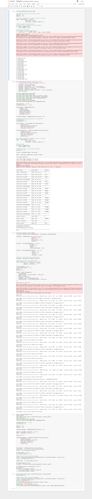

# Deficiency Identification in Plants
_________
Plants usually show deficiencies with major varying patterns on their leaves. Feature extraction and supervised machine learning algorithms are performed on the data-set of different
leaves, which is collected, processed and trained. The yield can be maximized by classification of healthy and unhealthy plants followed by identification of type of deficiency or disease.
This paper deals with a new approach to identifying deficiencies in plants, using classification of the leaf image. Despite the background images being compatible with other types, the
proposed system is capable of distinguishing between diseased and nutritious leaves or from the
environment by using efficient classification techniques.

The system is a reference of a deep neural network for image processing models.
The system allows users to upload an image of the plant leaf with differentiable background and
leaf color to categorize the image as a healthy or unhealthy leaf. The dataset used for training
consists of images containing 87k different healthy and unhealthy crop leaves. The trained
model is then used to categorize unhealthy leaves into further subclasses based on the pattern
observed. These subclasses are the diseases that fall under specific plant species. The system
can be modeled to reduce the resolution of the images while training to get optimal training time
and prediction results if needed. Based on the category of diseases mapped to the input image,
further, they can be mapped with the classes containing the type of nutrient deficiency observed
in the specific diseases observed. The system provides the user with the analysis of
the required nutrients, along with pesticides and fertilizer recommendations.

Description:
- Currently running on 18.218.89.61 with ubuntu 18.04
- Runs on python dependency written in requirements.txt seperately for app and api (folders) which runs as microservices in aws.
- Services for app is running nginx and gunicorn while api is running inside with only gunicorn.

### How to run
> git clone, go inside directory, run [docker-compose up --build] in terminal

*For better results use images with single leaf.*
__________
* Following is a graph of VGG-16 model for images of size 128x128 pixels.

* The model for images os size 128x128 pixels is as shown 

